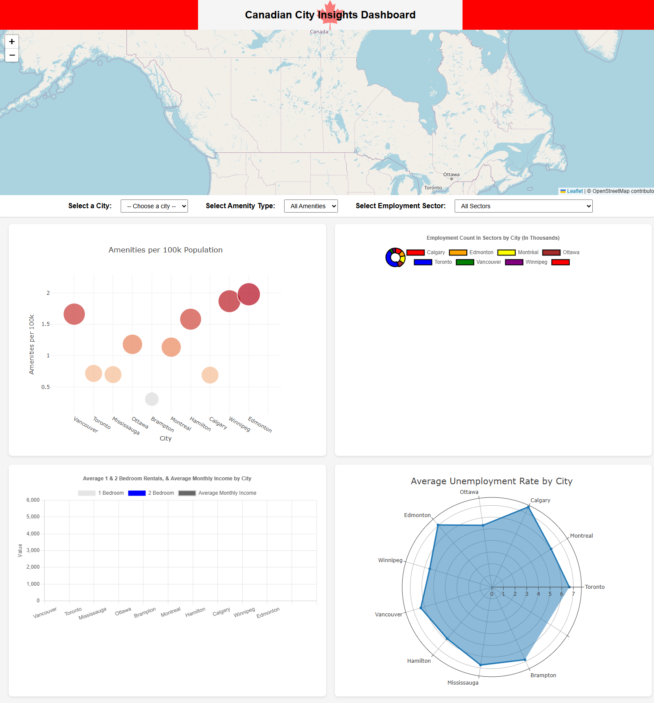

# Canadian City Insights Dashboard


## 📄 Description

Canadian City Insights Dashboard is an interactive web application that provides key insights into the rental prices, amenities, employment sectors, and unemployment rates across major Canadian cities. 

The dashboard combines interactive maps and visualizations to help users explore:
- Average rental prices by city
- Availability of amenities like hospitals, schools, and supermarkets
- Employment distribution across different sectors
- Unemployment rates per city

Data cleaning and preparation were performed using **Python** and **Pandas** within Jupyter Notebooks. The final interactive dashboard was built using **HTML**, **CSS**, **JavaScript**, and several visualization libraries.


## 🚀 Live Dashboard

Access the live dashboard here: [Canadian City Insights Dashboard](https://batuhanaysan.github.io/canadian-city-insights/)


## 🛠 Technologies Used

- **HTML, CSS, JavaScript**
- **Leaflet.js** – Interactive city and amenities map
- **Plotly.js** – Bubble and Radar charts
- **Chart.js** – Bar and Bar-Line charts
- **PapaParse.js** – CSV parsing in JavaScript
- **Python & Pandas** – Data cleaning and processing (Jupyter Notebooks)


## ✨ Features

- 📍 **Interactive Map:** Select a city to view amenities (hospitals, schools, supermarkets)
- 📊 **Bubble Chart:** Visualize the distribution of amenities per 100k population by city
- 📈 **Single Bar Chart:** Select a city to see employment distribution across 18 sectors
- 📉 **Radar Chart:** Compare unemployment rates across cities
- 🔄 **Dropdown Selections:** Dynamic updates for maps and charts


## 📈 Key Findings


## 📷 Dashboard Preview




## 📂 Folder Structure

```
CANADIAN-CITY-INSIGHTS/
├── Output/
│   ├── city_amenities_data.csv
│   ├── city_rent_population.csv
│   ├── dashboard_data.csv
│   ├── employment_sectors_by_city_df.csv
│   ├── unemployment_rates_data.csv
├── Resources/          # (content hidden)
├── static/
│   ├── js/
│   │   ├── bar_line_chart.js
│   │   ├── bubble_chart.js
│   │   ├── doughnut_chart.js
│   │   ├── map.js
│   │   ├── radar_chart.js
│   ├── style.css
│   ├── img/
│   │   ├── mapLeaf.png
│   │   ├── dashboard_preview.png
├── notebooks/
│   ├── amenities_data.ipynb
│   ├── dashboard_data.ipynb
│   ├── employment_sectors_details.ipynb
│   ├── rent_data.ipynb
├── .gitignore
├── index.html
├── README.md
```


## 🖥️ How to Run Locally

1. Clone the repository:
```bash
git clone https://github.com/batuhanaysan/canadian-city-insights.git
```

2. Navigate to the project directory:
```bash
cd canadian-city-insights
```

3. Start a local server (Python example):
```bash
python -m http.server
```

4. Open the project in your browser:
```bash
http://localhost:8000
```


## 📚 Data Sources

- [Statistics Canada](https://www.statcan.gc.ca/)
- [Rentals.ca](https://rentals.ca/)
- [ZipRecruiter - Average Salary Data](https://www.ziprecruiter.com/)
- [Geoapify API](https://www.geoapify.com/) (for amenities geolocation)


## 👥 Contributors

- [Batuhan Aysan](https://github.com/BatuhanAysan)
- [Harry Grewal](https://github.com/HGrewal13)
- [Shania Thilini](https://github.com/ShaniaThilini)


## 📜 License

This project currently does not have a license.


